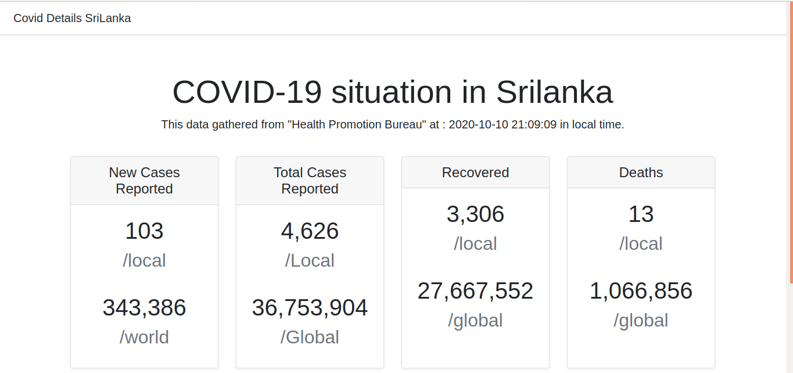

# covid simple dash board
using COVID Health Care Barau API in Srilanka made a web site for show state at the moment in PHP. 

Submitted by: **Kushan Tharaka**

Time spent: **3* hours spent in total

## User Stories

The following **essential** functionality is completed:

* [x] User can **view a list of total new cases reported locally and globally**
* [x] User can **view a list of recoverd in locally and globally**
* [x] User can **view a list of total cases reported in locally and globally**

## ScreenShot

Here's a walkthrough of implemented user stories:

## Notes

This is a simple web front which contains HTML CSS and bootstrap4. 
The web-page getting data from SriLankan Health API and transfer
RAW data into readable format using PHP.

<!--
Build a wedding planning web site from JSP/Servlets.
Wedding Planning Site was a winning idea, I won the entrepreneur club competition because of this web site, however, the web site is developed with JSP/Servlet based environment. The external database is MySQL database because of some JavaScript we can't recommend as production-ready but this is a fully functional web site for using. I have categorized three user groups as admin, service providers, and normal legitimate users. Service providers can make their advertisements on our website, publish it, make their details, and so on.
Then normal users can select the services that they are looking for at their wedding. 
-->

